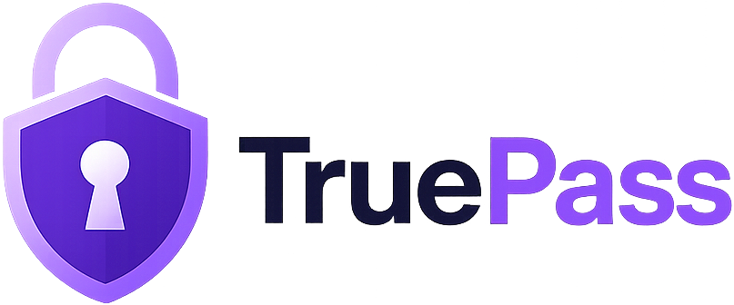
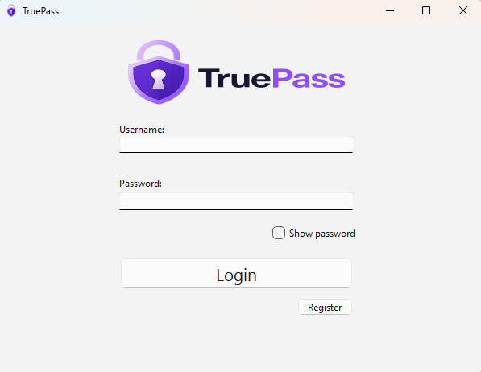
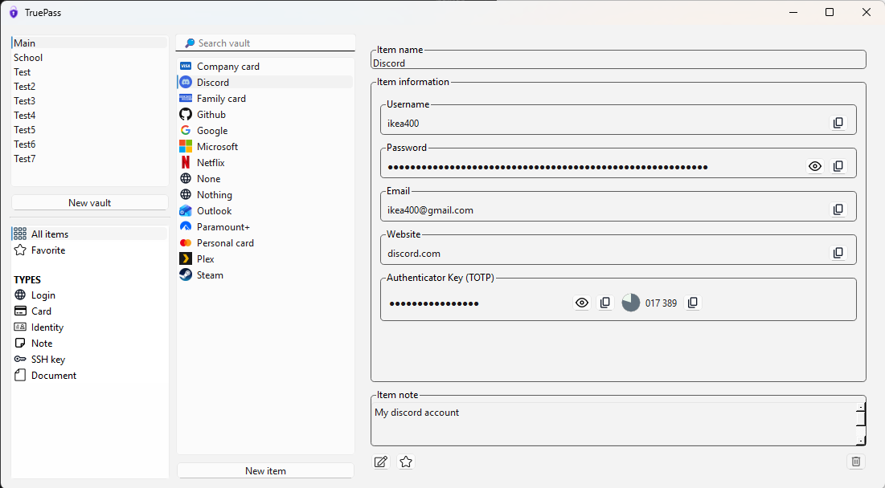

TruePass is a secure password manager built around a client/server architecture. It combines a Qt desktop client, a Drogon-based backend, and a shared C++ cryptography and data layer.er architecture. It combines a Qt desktop client, a Drogon-based backend, and a shared C++ cryptography and data layer.

## Overview

TruePass is designed to manage vaults and sensitive items such as logins and card data while keeping authentication and cryptographic operations in dedicated layers.

The project is split into three main parts:

- common — shared DTOs, validation, utilities, and cryptographic primitives
- server — HTTP API and persistence-facing services
- client — Qt desktop application for end users

## Features

- Secure registration and login flow using OPAQUE
- Device-bound authentication support
- Vault management
- Vault item management
- Login item support
- Card item support
- Password generation
- TOTP support
- Shared cryptographic utilities
- Validation helpers for user input
- Cross-platform client infrastructure with platform-specific TPM providers
- Unit tests for core cryptographic and utility components

## Architecture

### common

The shared library contains:

- cryptographic primitives and wrappers
- curve and key management utilities
- hash, HMAC, HKDF, Argon2, and KMAC helpers
- binary encoding helpers
- UUID utilities
- validation logic
- DTOs used by both client and server

### server

The backend exposes authentication and vault-related endpoints through Drogon. It handles:

- OPAQUE registration and login flows
- session handling
- device-bound login validation
- user, vault, and item data access

### client

The client is a Qt desktop application that provides:

- login and registration UI
- vault browsing and editing
- item creation and viewing
- password generation
- secure secret handling
- TPM provider abstraction for supported platforms

## Tech Stack

- C++23
- CMake 3.22+
- MSVC / GCC / Clang
- Qt 6
- Drogon
- OpenSSL
- JsonCpp
- glaze
- ctre
- ThorVG
- OPAQUE implementation through opaquepp
- GoogleTest for unit tests

## Prerequisites

Install the required build and runtime dependencies for your platform:

- A C++23-capable compiler
- CMake 3.22 or later
- Qt 6
- OpenSSL
- Drogon
- JsonCpp
- glaze
- ctre
- ThorVG
- OPAQUE library dependencies
- GoogleTest for test builds

If you use a package manager such as vcpkg, install the matching packages there or through your platform package manager.

## Build

From the repository root:

`bash
cmake -S . -B build
cmake --build build
`

## Run

### Server

The server loads its configuration from config.json and starts the HTTP service.

### Client

The client starts a Qt application and connects to the server at:

`	ext
https://localhost:443
`

Make sure the server is running before launching the client.

## Tests

Run the test suite from the build directory:

`bash
ctest --test-dir build
`

## Screenshots





## Project Structure

```text
TruePass/
├── common/       # Shared crypto, DTOs, validation, utilities
├── server/       # Backend API
├── client/       # Qt desktop client
└── CMakeLists.txt
```

## Notes

- The client and server share data contracts through the common library.
- Sensitive data is handled through dedicated wrappers and secure abstractions.
- Platform-specific TPM providers are used where available.
- The server and client depend on external libraries that must be installed separately.

## License

This project is licensed under the MIT License. See [LICENSE.txt](./LICENSE.txt) for more
